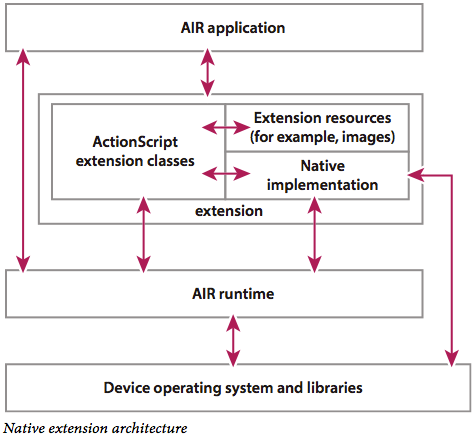

Adobe Air Natvie Extension
---

- [概览](#architecture-overview)
- [设备和扩展语言](#native-code-programming-languages)
- [开始编写ActionScript](#coding-the-ActionScript-side)
- [注意事项](warning)

### Architecture overview
AIR允许扩展：<br>
* 从ActionScript调用原生代码编写的方法
* 在ActionScript和原生代码之间共享数据
* 从原生代码派发事件到ActionScript
创建扩展需要提供：
* ActionScript扩展类
* 原生代码实现
* ActionScript或原生代码需要使用的资源



### Native code programming languages
设备 | 原生代码API
--- | ---
Android | Java API with the Android SDK <br> C API with the Android NDK
iOS | C API
Blackberry PlayBook | C API
Windows desktop | C API
Mac OS X desktop | C API
AIR for TV | C API

### Coding the ActionScript side
```actionscript
package com.pamakids.ane
{
	import flash.events.EventDispatcher;
	import flash.external.ExtensionContext;

	public class ShareSDK extends EventDispatcher
	{
		private var ext:ExtensionContext;

		public function ShareSDK()
		{
			if (!_instance)
				ext=ExtensionContext.createExtensionContext('com.pamakids.ane.ShareSDK', null);
			else
				throw Error('This is a singleton, use ShareSDK.instance, do not call the constructor directly.');
		}

		public static var _instance:ShareSDK;

		public static function get instance():ShareSDK
		{
			return _instance ? _instance : new ShareSDK();
		}

		public function dispose():void
		{
			if (ext)
			{
				ext.dispose();
				ext=null;
				_instance=null;
			}
		}
	}
}
```

### Warning

* extension里的nativeLibrary名称必须正确，否则编译正确但是打包会出错
* 同时需注意extension里的initializer和finalizer方法名是否正确，同样不影响编译，但是影响使用
* 扩展的id需要注意统一性