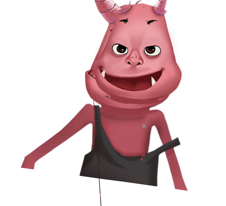
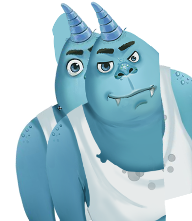
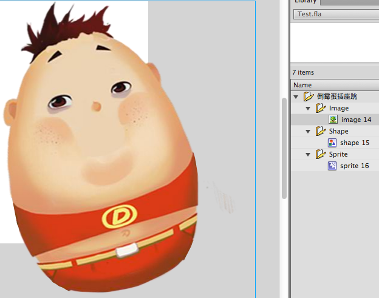
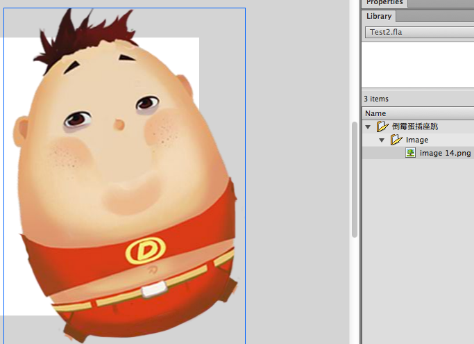
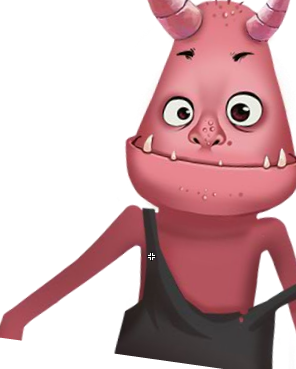

- [图片优化工具](#tools)
- [动画制作注意事项](#animation)
- [UI制作注意事项](#ui)

### Tools

- png优化工具 [win版本](http://pnggauntlet.com/#more),[mac版本](http://pngmini.com/)
- jpg优化工具 [mac版本](http://imageoptim.com/)

### Animation 

- 制作动画前应先将所用素材进行优化，需要动的位图需要在属性里设置`平滑`，否则会出现`锯齿`;不需要动的则不要设置平滑，设置后会增加`内存占用`
- 为方便管理维护，当有多个动画时，单个动画相关的资源需要放到`一个文件夹`里
- 为给程序使用，动画不能直接放在舞台上，需要新建一个元件，`放在元件里`，预览时将元件拖放到舞台即可
- 制作动画时，如果某动画有多个状态，而多个状态仅仅是动画的一小部分，则`不需要制作多个动画`，仅仅将那一小部分转换成元件，在元件里`做几帧来切换状态`即可，比如`蓝魔鬼钓鱼`动画
- flash里隐藏掉的图层，在实际使用中还是会出现，如果不用`需要删除`，比如最新的`打字页动画`，蓝魔鬼背后有个奇怪的东西
- 遇到动画需要播放到`某一帧`然后循环播放`之后所有帧`的情况时，将后面所有帧制作成`一个元件`，放在`最后一帧`即可，要预览效果可在最后一帧加上一句`stop()`代码
- 遇到动画只有`局部变化`时，只放`局部`素材即可，比如`打字页动画` 红魔鬼笑只把脸取出来是正确的，但还需要注意`把错误的像素清理掉`，比如图中删除遗留的线 蓝鼻子动画只有脸变化但放进去了整个身子，以及背后的污点是隐藏的层，没用应该删除
- 不要用在flash里擦除图形来获取需要图形，直接在photoshop里编辑裁剪好后，再放入flash使用，裁剪时在photoshop里选择Image->Trim，文件大小会更小， **trim时有可能看起来透明的区域未自动裁剪，因为绘图时可能遗留有像素点，可框选图形后Ctrl+J，把原图层删除后，然后再trim** ，比如制作倒霉蛋跳动画的身体 通过直接在flash里擦除图形制作，最终swf大小`238K` 在photoshop里裁剪后制作，最终swf大小`194K`
- 在某些时候，动画不需要在界面完全显示出来，需要对动画进行定位，原件里的`十字符号`就是该元件的`注册点`，也就是该动画的定位时使用的点，制作动画时将注册点事先定位好有助于程序里的最终定位，比如 `打字报告`里的红魔鬼坏笑，出现时只需要露出部分，此时假设将该动画定位到左下角，也就是将`注册点`定位到左下角，注册点右上部分就能显示出来。 **这种情况最好在制作动画之前先定位好，不然之后调整会比较麻烦，定位好后程序里再定位就更方便了，不用一直调试，来回沟通** 

### UI

- UI切图时需要Image->Trim，去掉无用的白边
- 切图需取巧，复杂的可跟程序沟通后再切，比如导航条上很多按钮，其实不用每个按钮切开，将导航条背景切出来，然后再切单个按钮icon即可